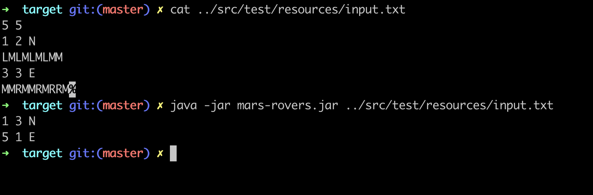
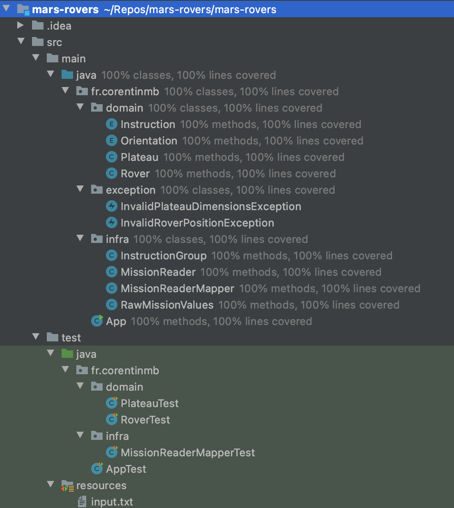

# mars-rovers

## Install
To run the app, make a package (you need to have Maven installed):

`cd mars-rover/`

`mvn package` 

And you can use the app by passing an input file as parameter (for example the one I use for tests):

`cd target/`

`java -jar target/mars-rover.jar ../src/test/resources/input.txt`

## Example of NASA mission !

## Fully covered code with unit tests

## Technologies

- Java 11
- Maven 3
- Junit 5
- AssertJ

## Architecture

Implemented a "light" clean architecture (domain/infra) to isolate the domain and business rules from the rest of the app (IO for file reading - aka Mission Reading), used mapper to transfer data accross layers. 
In the Domain package, you'll find classes relatives to the exercise (Rover, Plateau...), those domain models hosts directly business rules: they don't act as anemic models, but act as rich domain models.
The new orientation is determined thanks to the order of the enum (Orientation.java), each entry has an ordinal (unique id), I can iterate to "spin" left or right by searching for the previous() or the next() entry.
